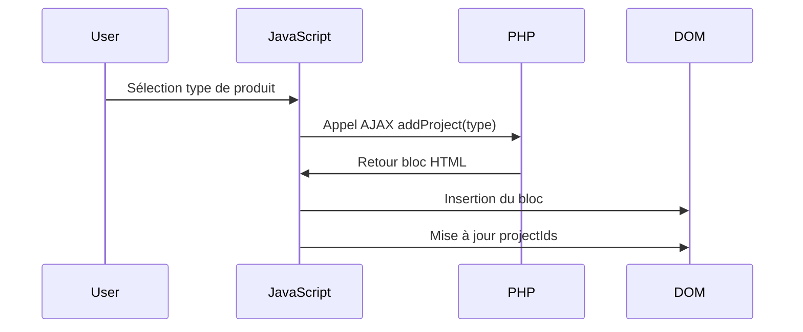
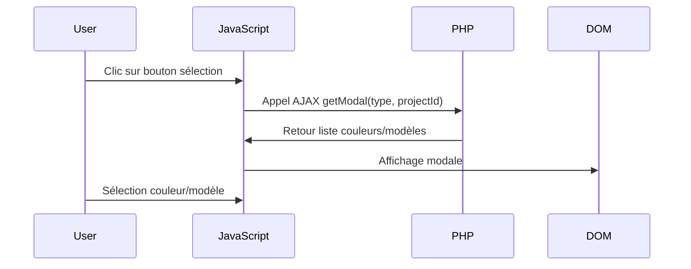

# Formulaire Devis ACPORTAIL

> Plateforme de génération de devis dynamique avec intégration CRM Pipedrive

## Objectifs

- Refonte complète du formulaire de devis ACPORTAIL
- Intégration avec Pipedrive pour la gestion automatisée des clients et devis dans le CRM

## Fonctionnalités

- **Formulaire dynamique** : Génération d'interface adaptative via JavaScript et PHP
- **API ACPORTAILRAL** : Récupération automatique des couleurs RAL et finitions disponibles
- **Base de données MySQL** : Gestion et récupération des modèles de produits
- **Intégration Pipedrive** : Vérification de l'existence des clients et création automatique des deals

## Technologies utilisées

| Technologie | Utilisation |
|-------------|-------------|
| **HTML/CSS/JavaScript** | Interface utilisateur et interactions dynamiques |
| **PHP** | Gestion serveur et orchestration des appels API |
| **MySQL** | Stockage et gestion des modèles de produits |
| **API ACPORTAILRAL** | Récupération des couleurs RAL et finitions |
| **API Pipedrive** | Gestion des clients et devis dans le CRM |

## Fonctionnement du formulaire dynamique

### 1 Ajout d'un projet



**Processus détaillé :**
1. La fonction JavaScript `addProject` effectue un appel AJAX vers le script PHP avec le type de produit
2. Le script PHP génère un bloc HTML avec des champs uniques (noms et IDs basés sur l'ID du projet)
3. Le JavaScript insère dynamiquement le bloc HTML dans le formulaire
4. Le champ caché `projectIds` est mis à jour avec la liste des IDs des projets actifs

### 2 Sélection de couleur ou modèle



**Processus détaillé :**
1. Une fonction Javascript effectue un appel AJAX au script PHP pour récupérer les options disponibles (couleurs RAL ou modèles)
2. Le script PHP interroge l'API ACPORTAILRAL ou la base de données MySQL selon le type demandé et renvoie les données au format JSON
3. Le JavaScript affiche une modale avec les options récupérées
4. L'utilisateur sélectionne une option, qui est ensuite appliquée au projet correspondant dans le formulaire
5. L'utilisateur sélectionne la couleur ou le modèle désiré, qui est alors affiché dans le formulaire et dans un champ caché pour la soumission

### 3 Soumission du formulaire


| Étape | Action | Description |
|-------|--------|-------------|
| **1** | Récupération | Extraction des IDs depuis `projectIds` et parcours des données de chaque projet |
| **2** | Validation | Vérification de l'intégrité et de la validité des données saisies |
| **3** | Gestion utilisateur | Recherche dans Pipedrive (téléphone/email)<br>→ Récupération si existe<br>→ Création si nouveau |
| **4** | Génération devis | Construction de la variable `$devis` avec la description complète des projets |
| **5** | Création deal | Création du deal dans Pipedrive lié au client |
| **6** | Redirection | Affichage de `formSended.php` (succès/erreur) |
| **7** | Protection | Redirection vers l'accueil en cas de rafraîchissement |

## Architecture des fichiers

```
formulaireDevis/
│
├── index.php                           # Page d'accueil
├── form.php                            # Page principale du formulaire
├── requete insertion table.sql         # Script SQL pour la base de données
├── TODO.md                             # Liste des tâches à faire
├── README.md                           # Documentation du projet
│
├── components/                         # Composants de l'application
│   │
│   ├── api/                           # Gestion des API et contrôleurs
│   │   ├── _getData.php               # Récupération des données
│   │   ├── _analyzeData.php           # Analyse et validation des données
│   │   ├── __writteDevis.php          # Génération du texte du devis
│   │   │
│   │   └── pipeDrive/                 # Intégration Pipedrive
│   │       ├── __fetchPersons.php     # Récupération des personnes
│   │       ├── __fetchByEmail.php     # Recherche par email
│   │       ├── __fetchByPhone.php     # Recherche par téléphone
│   │       ├── __checkPerson.php      # Vérification de l'existence d'une personne
│   │       ├── __addPerson.php        # Ajout d'une nouvelle personne
│   │       └── __addDeal.php          # Création d'un deal
│   │
│   ├── page/                          # Composants de pages
│   │   ├── header.php                 # En-tête du site
│   │   ├── footer.php                 # Pied de page du site
│   │   ├── formHeader.php             # En-tête du formulaire
│   │   ├── formBody.php               # Corps du formulaire
│   │   ├── formFooter.php             # Pied du formulaire
│   │   ├── formSended.php             # Page de confirmation d'envoi
│   │   └── sondage.php                # Questionnaire de satisfaction
│   │
│   ├── products/                      # Templates des produits
│   │   ├── _projectHeader.php         # En-tête de projet
│   │   ├── _projectFooter.php         # Pied de projet
│   │   ├── portail.php                # Formulaire portail
│   │   ├── portillon.php              # Formulaire portillon
│   │   ├── clotureRigide.php          # Formulaire clôture rigide
│   │   ├── clotureBeton.php           # Formulaire clôture béton
│   │   ├── clotureAluminium.php       # Formulaire clôture aluminium
│   │   ├── porteGarage.php            # Formulaire porte de garage
│   │   ├── store.php                  # Formulaire store
│   │   ├── pergola.php                # Formulaire pergola
│   │   ├── carPort.php                # Formulaire carport
│   │   ├── fournitures.php            # Formulaire fournitures
│   │   ├── maconnerie.php             # Formulaire maçonnerie
│   │   └── autre.php                  # Formulaire autre projet
│   │
│   └── utils/                         # Utilitaires
│       ├── __createInput.php          # Création d'inputs dynamiques
│       ├── loadEnv.php                # Chargement des variables d'environnement
│       ├── modelButton.php            # Bouton de sélection de modèle
│       ├── ralButton.php              # Bouton de sélection de couleur RAL
│       ├── modelProject.php           # Template de projet
│       ├── colorProject.php           # Gestion des couleurs de projet
│       │
│       ├── db/                        # Gestion base de données
│       │   ├── connect.php            # Connexion à la base de données
│       │   └── getModel.php           # Récupération des modèles
│       │
│       └── modals/                    # Modales
│           ├── modelModal.php         # Modale de sélection de modèle
│           └── ralModal.php           # Modale de sélection de couleur RAL
│
├── config/                            # Configuration
│
├── css/                               # Feuilles de style
│   └── modal.css                      # Styles des modales
│
└── js/                                # Scripts JavaScript
    ├── script.js                      # Script principal
    ├── _getModal.js                   # Gestion des modales
    │
    └── components/                    # Composants JavaScript
        ├── __CreateElement.js         # Création d'éléments DOM
        ├── __uncheckAll.js            # Désélection de tous les éléments
        ├── _AddProject.js             # Ajout de projet dynamique
        └── _ChangeProject.js          # Modification de projet
```


## Structure du formulaire

Le formulaire est organisé de manière hiérarchique :

```
formContainer (Conteneur principal)
│
├── sectionIdentite (Informations client)
├── sectionPromotion (Offres promotionnelles)
│
├── projectsContainer (Projets du client)
│   ├── projectTitle
│   ├── projectIds (champ caché - liste des IDs)
│   │
│   └── project (répétable)
│       ├── projectHeader
│       ├── projectBody
│       │   └── sections spécifiques au type de projet
│       └── projectFooter
│           └── bouton de suppression
│
└── formFooter (Validation et soumission)
```

## Ressources

- [Liste des tâches à réaliser](TODO.md)

---

**Développé pour ACPORTAIL** | Dernière mise à jour : Novembre 2025
    - sondage : Section de sondage de satisfaction

Chaque projet peut être de différents types (portail, portillon, clôture rigide, etc.) et possède des champs spécifiques.